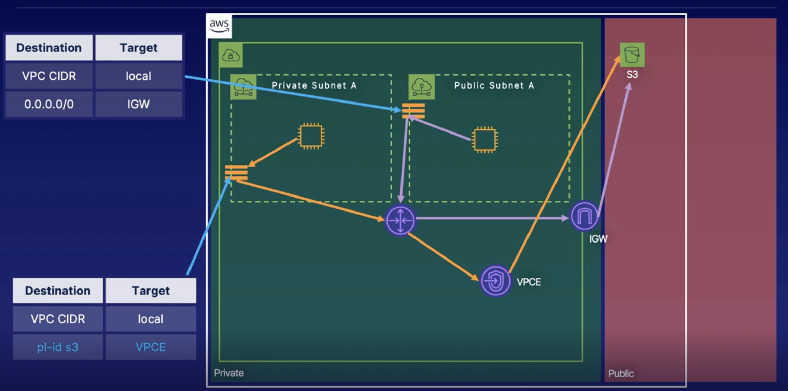

## Virtual Private Cloud (VPC)

Whenever you create a VPC, you get your own private network on AWS, private means you can use the address ranges such as `10.0.0.0/8`, `172.16.0.0/12` to design a network that isn’t necessary connected to the public internet. In the VPC, you can create subnets, route tables, NACLs, and gateways to the internet or a VPN endpoint.

You have a default VPC in each AWS Region. It comes with an internet gateway, and settings to enable DNS resolution (e.g. if a region has 5 AZs, it will have 5 public subnets associated with each of those AZs).

VPC operates at Region level: it spans AZs in a single Region.

You can have up to 5 VPCs in a single region, and you can request AWS support to increase this limit.

You have to specify 3 things when creating a new VPC:
- VPC Name Tag: a logical name that you use to reference the VPC.
- CIDR Block.
    - Cannot be changed once the VPC is created.
    - IPv6 is optional, but if you also choose a IPv6 address for the VPC then it will operate in dual-stack mode. In this mode, IPv6 and IPv6 operations are going to be independent from one another, you'll also need to have separate configuration for them.
    - IPv4:
        - Is required.
        - Can be chosen between a size of `/16` to `/28` CIDR block, which corresponds to a minimum of 2<sup>32-28</sup> = 16 and a maximum of 2<sup>32-16</sup> = 65536 IP allocations for our VPC.
        - You can select a private CIDR block range yourself.
        - There is differences between public and private addresses.
    - IPv6:
        - Is optinal.
        - Has a fixed size of `/56` CIDR block.
        - AWS assigns the private CIDR block for you, you can't select it.
        - There is no difference in public and private addresses. Security is controlled with routing and security policies.
    - IPv4 addresses are assigned to every resource in your VPC, regardless of whether you use IPv4 for communications. Because of this, the number of useable IPv6 addresses in your VPC is constrained by the number of available IPv4 addresses even if you're using IPv6.
- Tenancy: what you want your resources created in your VPC to fall into. 
    - Cannot be changed once the VPC is created.
    - 2 modes: default and dedicated.
        - Default mode gives you an option later to create your resources individually in dedicated mode within the VPC if needed.
        - Dedicated mode forces all resources created in the VPC to be in dedicated mode. An EC2 instance created in a dedicated mode VPC will be created on dedicated underlying hardware which is physically separated from other AWS accounts and other AWS customers. Remember that not all services have dedicated mode.

A VPC's private CIDR block range can be chosen from the following ranges which are reserved by The Internet Assigned Numbers Authority (IANA) for private internets. Of course as mention aboved, this VPC's private CIDR block range must has a size of `/16` to `/28`, but it is a pretty much industry standard to use the `/16` range because it offers the largest number of subnet masks:
- `192.168.0.0/16` (`192.168.0.0` to `192.168.255.255`).
    - offers 1 `/16` ranges (to choose from).
- `172.16.0.0/12` (`172.16.0.0` to `172.31.255.255`).
    - offers 16 `/16` ranges.
- `10.0.0.0/8` (`10.0.0.0` to `10.255.255.255`).
    - offers 256 `/16` ranges.

There are some high level considerations to think about when you choose a VPC CIDR block:
- Integrate with other VPCs: you should ideally aim for non-overlappings IP addresses.
    - VPCs are using private addressing spaces and can use overlapping addressing spaces if needed as long as the communication between those VPCs are not neccessary.
- Your VPC CIDR block range should also not overlap with any on-premise networks.
- Plans for [subnetting](/networking/tcpip/14-network-layer-ipv4-subnetting.md): this depends on your infrastructure (such as number of tiers: db, webserver, mnanagement, etc.) and future planning.

## Subnet

Subnet is a segment of a VPC’s IP address range that allows you to isolate resources and separate concerns. A rule of thumb is to have at least 2 subnets: public and private, a public subnet has a route to the internet, a private one does not. Your public-facing resources such as load balancers, web servers, host bastion should be in the public subnet, and private resources such as database should reside in the private subnet. Traffic between subnets of a VPC is always routed by default, you can’t remove the routes between subnets. If you want to prevent traffic between subnets in a VPC, you need to use NACLs attached to the subnet. AWS permits up to 200 subnets per AZ.

AWS reserves the first 4 IPv4 addresses and the last IPv4 address of every subnet for internal networking purposes. So in a subnet, a total of 5 addresses are always reserved by AWS. For example, in a subnet whose CIDR block range is `10.10.64.0/21`:
- 1st address `10.10.64.0`: subnet address.
- 2nd address `10.10.64.1`: reserved by AWS for VPC Router.
- 3rd address `10.10.64.2`: IP address for DNS server.
- 4th address `10.10.64.3`: reserved by AWS for future use.
- Last address `10.10.71.255`: direct broadcast address.

## VPC Router

The VPC Router is a logical construct/service where all routing decisions begin. It is provided within a standard VPC. This is the first place packets hit when leaving resources that are in a VPC/subnet. Routing decision are then governed by route tables associated with VPCs and subnets.

You can't find this resource in AWS console because it has no direct exposure.

Each subnet in a VPC will (logically) attach to 1 VPC router.

Some VPC router's important roles:
- Providing subnets within a VPC inner communication.
- Brokering communication with other networking constructs (IGW, Virtual Private Gateway, NAT instances, NAT gatewate, etc.) in a VPC.

When instances are launched/created in a VPC, as part of DHCP mechanism:
- VPC router is provided as the default gateway to the instances.
- Private IP address (and DNS) given to the instances by the DHCP server in the VPC are AWS provided values by default.

Note that this can be changed if we decide to create custom DHCP option sets.

After the packets hit the VPC router, what happens next in how the packet is routed can be controlled by us.

## Route Table

It contains a set of rules, called routes, that determine where network traffic from your subset or gateway is directed.

A route entry consists of 2 things: a destination and a target.

Key concepts:
- Main route table: when you create a new VPC, there’s a Main route table that automatically comes with it. It controls the routing for all subnets that are not explicitly associated with any other route table. The main route table has a default local route entry that allows our subnets to communicate with each other.
- Custom route table: a route table that you create for your VPC.
- Destination (the packet's final destination): the range of IP addresses (CIDR block ranges) you want your traffic to go.
- Target (where the packet should go next): VPC logical constructs such as gateways, network interfaces, or constructs through which to send the destination traffic (for example target can be an internet gateway).
- Route table association: the association between a route table and a subnet, internet gateway, or virtual private gateway. For example, when a route table is associated with a subnet, traffic in the subnet will follow the rules defined in that route table.

## Elastic Network Interface (ENI)

ENI is a virtual network interface that connects instances to the network (e.g. VPC).

We already learned that when an instance is created in a VPC, a private IP address is assigned to it by the DHPC server in the VPC. Under the hood, instead of an IP address being directly added to an instance, a default immediate ENI object is created and attached to it; this provides the instance the network connectivity. This default ENI cannot be deleted or detached and lives for the instance's lifecycle.

Things that associated to an ENI:
- Mac address: a virtual hardware address that is unique to the ENI and matches its lifecycle.
- Internal private IP address: associated with the ENI via the VPC's DHCP server.
- Dynamic external public IP address: lost on rebooting/stopping/terminating the instance.
- An Elastic IP address can be optionally associated to an ENI, even after instance creation.
- Source and destination check attributes: used to enable/disable the dropping of packets for network traffic that is not specifically destined for the instance.
- At least 1 security groups: so you don't assign security groups to an instance, but the ENI associated to that instance.

Instances can have 1 or more ENIs attached and associates with it [depending on its type](https://docs.aws.amazon.com/AWSEC2/latest/UserGuide/using-eni.html) (EC2 instance type). Any non-default ENI created after launching an instance can be detached and reattached to any other instance in same AZ.

You cannot add more ENIs to an EC2 instance to improve bandwidth to or from that instance.

With ENI we can launch an EC2 instance into separate subnets (in the same AZ) by creating ENIs in subnets we want to launch the EC2 into and attach them to the EC2 instance. You might want to do this in case you want the instance to be accessed by different entities for different purposes, for example public access from the internet through a public subnet (via Internet Gateway) and internal teams access from a corporate data center through a private subnet (via Virtual Private Gateway), and you can have the ENI in each subnet associated to appropriate security groups to control the corresponding access.

## Internet Gateway

It is conceptually created and attached to the edge of the VPC and translates the public destination address of internet traffic coming to an instance to its private address and forwards the traffic to the VPC and vice versa. So it allows VPC resources to communicate with other public resources (AWS or public internet endpoints).

An internet gateway is created in a specific region and can only be attached to 1 VPC, 1 VPC also cannot have multiple internet gateways.

Getting traffic to flow from VPC resources to the internet gateway is done via the VPC router, this traffic is governed by the route tables associated with subnets. In these route tables, we need to have an entry that takes internet traffic coming from VPC resources and forward them to the internet gateway (and vice versa):
```text
Destination         Target
0.0.0.0/0           igw-abcxyz
```

## Elastic IP

Elastic IP address is a static, public IPv4 address that you can allocate to your account (taken from the AWS regional IPv4 pool) and release from your account (returned to the pool).

Elastic IP address can be associated to an ENI.

By default you can have up to 5 total elastic IPs.

## Security Groups

Security group is a firewall at resource level that control incoming and outgoing traffic for each resource type, it is applied to ENIs or resources (EC2, RDS, ELB, etc.) they are associated with (with resource we mean the ENI attached to that resource).

Every VPC you create will have a default security group associated with it. Anytime a resource is launched within the VPC without being specified a security group, the default security group will be applied to that resource.

One security group can be applied to multiple ENIs, this allows us to apply a set of rules to multiple ENIs/resources.

One ENI can also be associated with multiple security groups, the product of the rules are combined and applied to that resource.

Security groups are stateful, this means return traffic is automatically allowed regardless of any rules.
- For example, when you SSH to a VM firewalled by a security group, the sshd (SSH daemon) accepts the connection on port 22 but uses an ephemeral port for communication with the client, ephemeral ports are selected from 1024 to 65535. You only need to open inbound port 22 on the security group without the corresponding outbound rule on the ephemeral port. The outbound traffic is atomatically allowed even when there's no outbound rule specified in the security group(s) that firewall the VM.
- Another example is the opposite direction, where the VM initiates an SSH request to some server, the return traffic on ephemeral port (inbound traffic to the VM) is automatically allowed even when there's no inbound rule specified in the security group(s) that firewall the VM.

Security groups can specify allow rules, but not deny rules (they actually have a deny rule implicitly built in them).

Security groups evaluate all rules, in any order, to decide whether to allow the traffic.

Each rule allows the traffic based on the following:
- Direction: inbound or outbound.
- IP protocol: TCP, UDP, ICMP (for pinging).
- Port.
- Source/Destination based on IP address, IP address range or security group.

By default, a security group does not allow any inbound traffic and contains a rule allowing all outbound traffic by default.

## Network Access Control Lists (NACL)

NACL is a firewall that operates at the subnet level that restrict traffic that goes from 1 subnet to another, traffic is processed before it enters or leaves the subnet, it is applied to any resource launched into a subnet. That’s an additional layer of security on top of security groups.

Every VPC you create will come with a NACL, this NACL will be applied by default to any subnet you create within that VPC.

One NACL can be applied to multiple subnets, but each subnet can only (and must) be associated to one NACL.

NACLs are stateless (refer to [Security Group](#security-groups) for more details), this means you need to explicitly define inbound and corresponding outbound rule, especially rule for ephemeral ports for communications in a client server fashion. 

NACLs can specify both allow and deny rules.

Below is an example of a NACL's inbound rules:
|Rule #|Type|Protocol|Port Range|Source|Allow/Deny|
|-|-|-|-|-|-|
|100|SSH|TCP|22|0.0.0.0/0|Allow|
|200|HTTP|TCP|80|1.2.3.4/32|Deny|
|300|Custom TCP|TCP|49152-65535|0.0.0.0/0|Allow|
|*|All IPv4 traffic|All|All|0.0.0.0/0|Deny|
- For list of outbound rules, we'll see Destination rather than Source.
- NACLs evaluate rules in order (starting from low rule number) to decide whether to allow/deny traffic.
- At the end of every single NACL, there's an implicit rule that can't be removed nor modified, it is for fallback matching. It always applies a Deny.

## NAT gateway

NAT gateway is an AWS managed service that allows us to create elastic NAT translations within our VPC: resources that have private IP addresses share a single public IP address to access the internet. It does so by changing the source IP address of packets to the NAT's public IP address, which is publicly routable, this allows packets to be sent out to their final destination. Private to public mapping records which allow for the same tranlation when traffic is returned and needs to be routed to the private address are kept in these NAT servers.

When we create a NAT gateway, we need to provide the subnet to launch it in and an elastic IP address. From here we create the appropriate route table entries to route outbound internet traffic from private IP address to the NAT gateway.

To increase availability, we can create another NAT gateway in another subnet in another AZ.

NAT gateways are elastic, they wil grow and shrink as the traffic increases.

NAT gateways scales up to 45 Gbps, if you need more you can just attach more NAT gateways into your subnet(s). By default you can have up to 5 NAT gateways per AZ.

Pricing: the cost depends on the amount of data that is sent through the NAT gateway.

We cannot associate SGs with a NAT gateway, but can associate SGs with resources behind it (such as subnets).

## VPC Endpoint

When an AWS resource in a private subnet need to access a (AWS) service outside of the VPC, we have to use one of the following solutions to allow the resource to communicate with the service:
- use [NAT gateways](#nat-gateway).
- use [internet gateways](#internet-gateway).
- VPNs.

This led to security concerns as NAT gateways, internet gateways, VPNs can be target for attacks.

With VPC endpoints, resources in private subnet can access AWS services without exposing the traffic to the public internet, all traffic is internet and stay within the AWS network.

2 types of interface endpoints:
- Interface endpoint:
    - Powered by AWS PrivateLink (which is a way to provide private connectivity between VPCs, AWS services and on premise applications on the AWS network).
    - AWS PrivateLink creates endpoints using an ENI with a private ip address.
    - These endpoints will be typical DNS endpoints and serve as entry points for your traffic.
    - Support many services.
- Gateway endpoint:
    - Endpoints are setup as targets or logical constructs that we can specify as a target in our route table.
    - Only supports S3 and DDB.

Choosing which one to use depends on which service you want to access.

Whenever we create a VPC endpoint, we need to specify:
- the VPC we want to launch it in.
- the service that we want to connect to using the endpoint.
- a policy to help restrict access to resources via the endpoint (e.g. buckets within S3, tables within DDB; this policy is different from the service's policy, for example a endpoint can allow all access to an S3 bucket but the S3 bucket itself can deny the traffic.

When the VPC endpoint is setup, we'll have a VPC endpoint ID (VPC EID) that we can add to the routing table that is associated with the subnet we want resources to have access to, the destination column will be a prefixed list ID which can be thought of as a logical object that presents a list of IP addresses for the region and service specific routes used by the services in the private subnet we are creating the endpoint for.



Key things:
- Endpoints are a regional service: you can't access and endpoint in a region from another region.
- Endpoints cannot be accessed from outside a VPC or from another VPC.
- DNS resolution is needed within a VPC to access the endpoints in that VPC.
- By default, VPC endpoints policy is unrestricted.
- You can have multiple VPC endpoints within the same VPC, even for the same service. Each endpoint can have its own policy, and each can be applied to different subnets.

